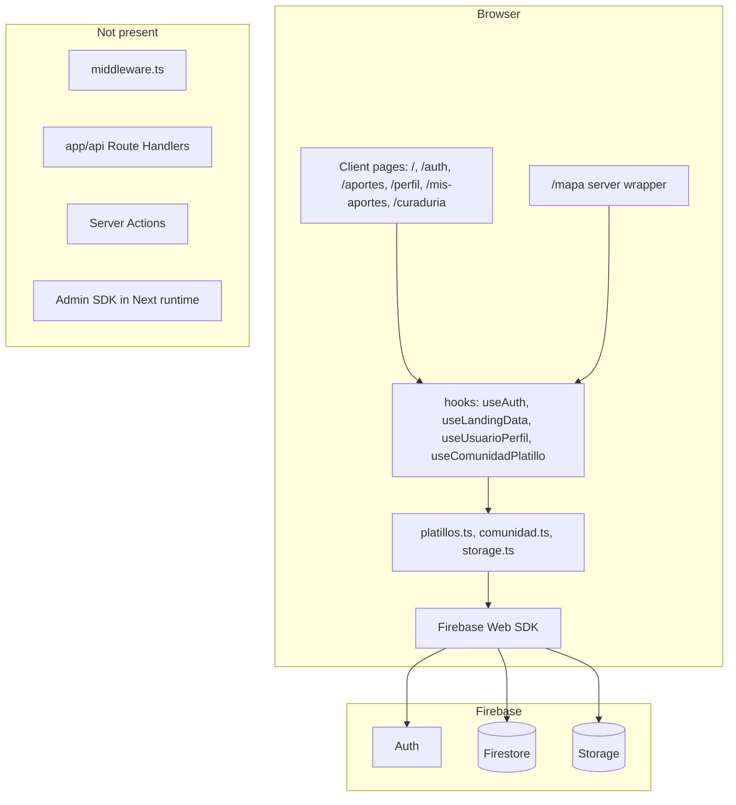
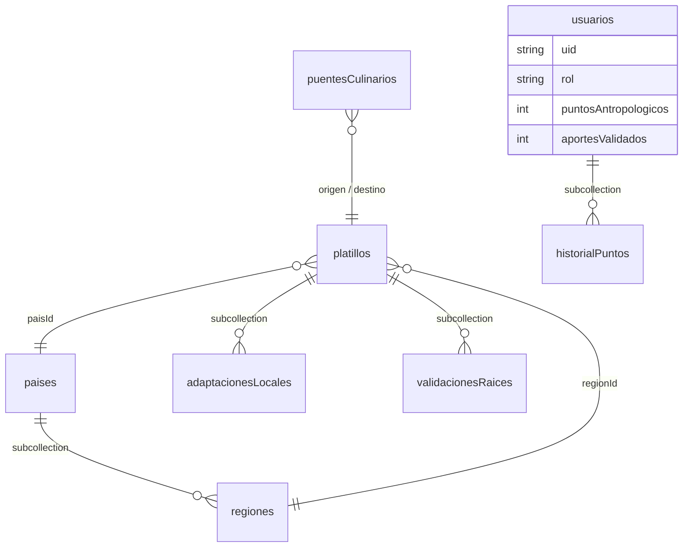
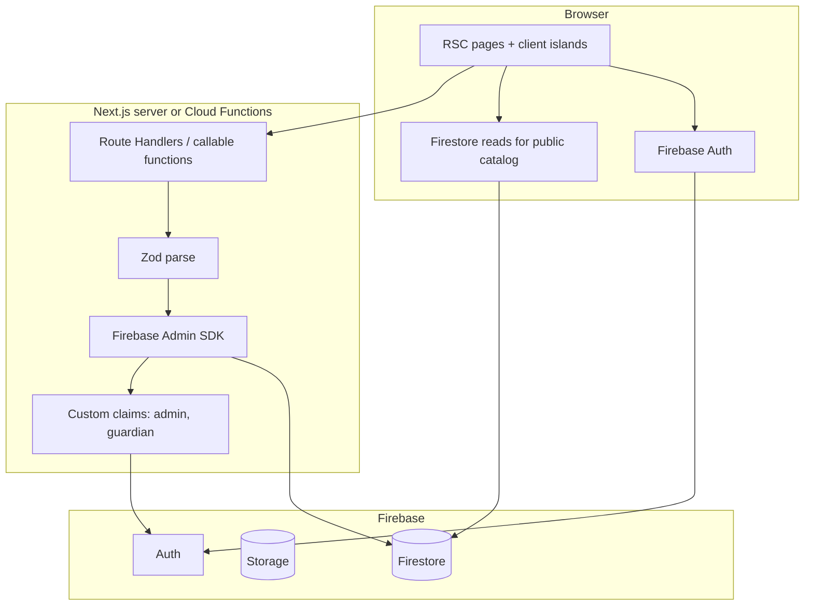

# BiteAtlas — Architecture & Engineering Audit

**Role:** Independent architect and full-stack consultant  
**Scope:** Read-only review of the repository as of 28 August 2026  
**Constraint honored:** No application code, configuration, or tests were modified. This file is the only deliverable.

This report evaluates BiteAtlas as a production-bound product: cartographic exploration, cultural recipe sheets, community contributions, gamification, and curaduría. Findings are based on the source tree, Firebase rules, specs, and conventions in `.agents/AGENTS.md` and `spec/`.

---

## 1. Executive summary

BiteAtlas already has a coherent **product domain** and a stronger **domain model** than most early-stage apps: Zod schemas for countries, recipes, profiles, and community entities; a multi-step contribution wizard; a Leaflet exploration map; an SVG landing atlas; and a community/gamification service with transactions and tests.

The architecture underneath that product is still a **client-trust Firebase SPA** living inside Next.js App Router. The browser talks directly to Auth, Firestore, and Storage. There are no Route Handlers, no Server Actions, no middleware, and no Admin SDK in the Next.js runtime. Business rules that matter (roles, points, approvals) run in the client and are only weakly enforced by security rules.

**If this shipped as-is, a signed-in user could promote themselves to Guardián/Maestro, inflate XP, and approve or mutate community proposals.** Curaduría is a UI gate on a field the user can write.

That is the single most important finding. Everything else is quality, scale, or maintainability.

### Scorecard

| Area                      | Grade  | One-line verdict                                                               |
| ------------------------- | ------ | ------------------------------------------------------------------------------ |
| Product / domain modeling | **B+** | Clear entities, good Zod schemas, mission is visible in the UI                 |
| Next.js App Router usage  | **D**  | Almost every route is a client page; missing layouts, loading, error, metadata |
| Frontend component design | **B-** | Domain folders are clear; two map stacks and duplicated shells                 |
| Data / services layer     | **C**  | `comunidad.ts` is mature; platillo writes and reads skip Zod                   |
| Firebase security         | **F**  | Rules allow self-grant of roles, points, and community updates                 |
| Authorization             | **D**  | Auth exists; authorization is cosmetic                                         |
| Testing                   | **C+** | 15 files, solid schemas/community; critical flows untested                     |
| Observability / ops       | **D**  | No CI, no `.env.example`, dual lockfiles, build risk from scripts              |
| Documentation fidelity    | **C-** | Specs exist in `spec/`; AGENTS/README/constitution are stale                   |
| Accessibility / i18n      | **D+** | Infrastructure exists; most product surfaces are Spanish-only                  |

**Recommended posture:** treat security-rule hardening as a release blocker. Do not grow more community features on top of a client-writable reputation system.

---

## 2. What was reviewed

| Layer            | Primary paths                                                                                  |
| ---------------- | ---------------------------------------------------------------------------------------------- |
| App Router       | `src/app/**`                                                                                   |
| UI               | `src/components/**`                                                                            |
| Services & hooks | `src/services/**`                                                                              |
| Types / Zod      | `src/types/**`                                                                                 |
| Errors           | `src/errors/**`                                                                                |
| i18n             | `src/i18n/**`                                                                                  |
| Scripts          | `src/scripts/**` (not `legacy/` — that folder does not exist)                                  |
| Firebase         | `firestore.rules`, `storage.rules`, `firebase.json`, `storage-cors.json`                       |
| Tooling          | `package.json`, `tsconfig.json`, `next.config.ts`, `vitest.config.ts`, Husky, ESLint, Prettier |
| Specs            | `spec/constitution/**`, `spec/features/001`–`008`                                              |
| Conventions      | `.agents/AGENTS.md`, root `AGENTS.md`                                                          |

No production Firebase project was queried. Security conclusions come from rules + the client code that writes those documents.

---

## 3. Current architecture (as built)



### Runtime shape

- **Next.js 16.3.1** + **React 19.2.8** + **TypeScript strict** (`noUncheckedIndexedAccess`, `noImplicitReturns`).
- **Firebase Web SDK 12** initialized in `src/services/firebase.ts` from `NEXT_PUBLIC_*` env vars.
- **firebase-admin** is used only by seed/purge scripts.
- **No `src/app/api/**`**, no `"use server"`, no `middleware.ts`.
- Seven of eight routes are `'use client'`. `/mapa` is a thin server page that immediately loads a client Leaflet map.

### Route inventory

| Route            | File                             | Rendering                | Role                             |
| ---------------- | -------------------------------- | ------------------------ | -------------------------------- |
| `/`              | `src/app/page.tsx`               | Client + `force-dynamic` | Landing atlas + featured recipes |
| `/mapa`          | `src/app/mapa/page.tsx`          | Server shell             | Exploration map                  |
| `/auth/login`    | `src/app/auth/login/page.tsx`    | Client                   | Email + Google                   |
| `/auth/register` | `src/app/auth/register/page.tsx` | Client                   | Near-duplicate of login          |
| `/aportes`       | `src/app/aportes/page.tsx`       | Client                   | Contribution wizard              |
| `/mis-aportes`   | `src/app/mis-aportes/page.tsx`   | Client                   | Owner list + inline edit         |
| `/perfil`        | `src/app/perfil/page.tsx`        | Client                   | Profile + badges                 |
| `/curaduria`     | `src/app/curaduria/page.tsx`     | Client                   | Role-gated curation              |

Missing App Router primitives: route groups, nested layouts, `loading.tsx`, `error.tsx`, `not-found.tsx`, per-route `generateMetadata`, intercepting routes for recipe sheets.

### Intended vs actual data model

The constitution (`spec/constitution/tech-stack.md`) describes **país → región → platillo** as a nested hierarchy. Firestore rules still declare nested `paises/{id}/regiones/{id}/platillos` with `write: false`. **The app writes platillos at the root collection `platillos/`** with `paisId` / `regionId` foreign keys.



Secondary collections:

- `ingredientes/` — rules exist; the form uses free-text `ingredienteId`, not the catalog.
- `aportes/` — rules exist; **no application code uses this collection**.
- `puentesCulinarios/` — root collection (correctly used).
- `adaptacionesLocales` — written as **subcollection under platillo**; curaduría queries a **root** collection that will be empty.

---

## 4. What is already working well

These are real assets. Do not throw them away in a rewrite.

1. **Domain-first TypeScript.** `src/types/schemas.ts` is the best module in the repo: inferred types, Firestore timestamp preprocessors, community and recipe schemas, and a thorough `schemas.test.ts`.
2. **Contribution wizard.** `FormularioAporte` + per-step Zod + react-hook-form + localStorage drafts (`useBorradorAporte`) is a solid UX pattern.
3. **Community service depth.** `src/services/comunidad.ts` uses transactions, Zod on many writes, role-threshold functions, and consensus helpers. Pure functions are tested.
4. **Leaflet SSR isolation.** `MapaMundiLoader` and `SelectorUbicacionLoader` use `dynamic(..., { ssr: false })` correctly.
5. **Seed safety.** `seed-atlas.ts` validates with Zod before write, batches at 450 ops, merges idempotently. `purge-seed-data.ts` is dry-run by default and requires `--confirm`.
6. **Type hygiene.** No `any` in `src/`. `tsconfig` is stricter than the Next default.
7. **Auth UX details.** Friendly Spanish Firebase Auth mapping in `useAuth`; COOP header in `next.config.ts` for Google popup.
8. **Secret hygiene.** `.env*` is gitignored; no service-account JSON or hardcoded keys in source.
9. **Editorial visual identity.** Landing, aportes, and perfil share a distinctive cartographic palette. This is product, not leftover template chrome.
10. **Spec-driven intent.** Features 001–008 exist under `spec/features/`. The team already knows how it wants to work.

---

## 5. Priority findings

Severity:

- **P0** — exploitable, ship-blocking, or silently broken core flow
- **P1** — high cost, incorrect behavior, or will become P0 under load
- **P2** — maintainability, polish, documentation

### P0 — Security: reputation and moderation are client-owned

**Files:** `firestore.rules` (usuarios L61–72, puentes L88–100, adaptaciones L103–107, aportes L54–57), `src/app/curaduria/page.tsx`, `src/services/comunidad.ts`

Firestore allows the document owner to `create`/`update` **any field** on `usuarios/{userId}`, including `rol`, `puntosAntropologicos`, `puntosCuraduria`, `insignias`, and `aportesValidados`. The same user may write `historialPuntos`.

Any signed-in user may `update` any `puentesCulinarios` or `adaptacionesLocales` document (no field mask, no role check).

`/curaduria` decides access with:

```ts
const esCurador = perfil.rol === 'guardian' || perfil.rol === 'maestro'
```

That `rol` is stored in a document the user can edit from the Firebase client (or any script using the public config). The Admin custom claim `request.auth.token.admin` is referenced in rules and **never set anywhere in this repo**.

`aportes/{id}` allows `create: if true` (unauthenticated writes to a collection the app does not use).

**Recommendation:** lock privileged fields to Admin SDK / Cloud Functions; restrict community updates to append-only approval arrays for guardians (verified via custom claims, not a Firestore field); delete or lock `aportes/`. See §10.

### P0 — Curaduría of adaptaciones is querying the wrong path

**File:** `src/components/admin/PanelCuraduria.tsx` L48–50

Writes go to `platillos/{id}/adaptacionesLocales/{id}` (`comunidad.ts` `crearAdaptacionLocal`). The panel queries root `collection(firestore, 'adaptacionesLocales')`. The `.catch(() => ({ docs: [] }))` hides the failure. Guardians will see an empty Adaptaciones tab even when proposals exist.

**Recommendation:** `collectionGroup('adaptacionesLocales')` plus a composite index, or query per known platillo. Add a failing test before the fix.

### P0 — Platillo moderation UI is built and unreachable

**Files:** `src/components/admin/AdminPanel.tsx`, `src/components/admin/index.ts`

`AdminPanel` can list pendiente/publicado/rechazado platillos. No route imports it. Combined with no admin custom-claim bootstrap, **user-submitted recipes have no in-app publish path**. They stay `pendiente` unless someone writes Firestore by hand.

This contradicts the product rule that contributions require moderation.

### P0 — Production build is at risk from script imports

**Files:** `src/scripts/seed-atlas.ts`, `src/scripts/purge-seed-data.ts`, `package.json`

Both scripts `import dotenv from 'dotenv'`. `dotenv` is **not** in `package.json`. `tsconfig.json` includes `**/*.ts`, so `next build` typechecks those scripts. This is a likely production-build break.

**Recommendation:** move scripts out of the Next compile graph (`tsconfig` exclude), or add `dotenv` as a **devDependency** after explicit approval (AGENTS.md forbids unapproved deps). Prefer `node --env-file=.env.local` and drop the import.

### P0 — No CI and hooks do not match the stated quality bar

`.agents/AGENTS.md` says tests must pass before each commit and lint before each PR. Reality:

- No `.github/workflows` (or other CI)
- `.husky/pre-commit` runs `lint-staged` only
- Tests are never gated

A broken build or failing suite can reach `main` unnoticed.

---

### P1 — App Router is used as a file-based SPA host

Almost all data fetching happens in `useEffect` inside client hooks. The home page is a large client component with `export const dynamic = 'force-dynamic'`, which does not buy SSR data for a client tree.

Consequences:

- Public atlas data cannot use ISR / `revalidate`
- Duplicate Firestore reads on `/` and `/mapa` (each mounts `useLandingData`)
- No streaming `loading.tsx`, no `error.tsx`
- SEO metadata is only the root title/description
- Auth guards flash empty/loading UI instead of being enforced at the edge

**Recommendation:** server-fetch public catalog in RSC; keep maps, wizard, and auth as client islands. Add `(marketing)`, `(app)`, and `auth` layouts.

### P1 — N+1 region reads on every landing/map load

**File:** `src/services/hooks/useLandingData.ts` L61–73

After loading all `paises`, the hook fires **one `getDocs` per country** for `paises/{id}/regiones`. `useCountriesRegions` repeats a similar pattern. `usePaises` is unused in the UI.

At world-catalog scale this is hundreds of reads per page view, paid on every visit, with no cache (no React Query / SWR / RSC cache).

**Recommendation:** one shared `AtlasProvider` or server loader; denormalize a `regiones[]` summary on the country doc, or a single `regiones` collection / collection group.

### P1 — Zod is not applied at all data boundaries

AGENTS.md: validate every input with Zod before use.

| Boundary                             | Validated?                                    |
| ------------------------------------ | --------------------------------------------- |
| Wizard UI                            | Yes — local schemas in `FormularioAporte.tsx` |
| `createPlatillo` / `updatePlatillo`  | **No** — hand-written interface               |
| Firestore reads in landing/geo hooks | **No** — `as Pais` / `as Platillo`            |
| Community writes                     | Yes — `comunidad.ts`                          |
| localStorage drafts                  | `JSON.parse` only                             |
| Storage uploads                      | MIME + size only                              |

The form schemas are a **second, divergent copy** of `PlatilloSchema` (different required fields, different message style). Types for the form live in a component and are imported by `useBorradorAporte` (dependency inversion).

**Recommendation:** `PlatilloDraftSchema` / `PlatilloWriteSchema` in `src/types`; `safeParse` in services and read adapters.

### P1 — Document ID vs embedded `id` on platillos

**File:** `src/services/platillos.ts` L53–83

`addDoc` generates the Firestore ID. The payload also stores a `crypto.randomUUID()` as `id`. Reads later use `document.id`. The two identifiers can diverge. Updates happen to work because pages use the snapshot ID, but any code that trusts `data.id` will break.

**Recommendation:** `setDoc(doc(db, 'platillos', id), …)` so field and path are the same.

### P1 — Two map systems without a shared data contract

| Folder                  | Tech                       | Used on     |
| ----------------------- | -------------------------- | ----------- |
| `src/components/mapas/` | Custom SVG + Framer Motion | Landing `/` |
| `src/components/mapa/`  | Leaflet + react-leaflet    | `/mapa`     |

The split is legitimate (decorative atlas vs operational map). The problem is duplicated selection UX and two independent `useLandingData()` subscriptions. `FeaturedRegionMapBackground` is unused in production pages (only mocked in `page.test.tsx`).

**Recommendation:** keep both renderers; extract `AtlasData` + `selectedCountryId` into one provider. Rename folders to `atlas-svg/` and `atlas-leaflet/` when you touch them.

### P1 — Pages bypass the service layer

`src/app/mis-aportes/page.tsx` queries Firestore directly. `PanelCuraduria` does the same. That bypasses Zod, error types, and makes the “services own Firebase” rule false.

### P1 — i18n and a11y are incomplete

`useI18n` is wired on the landing, `UserNav`, `LanguageSelector`, and parts of `MapaMundi`. Auth, wizard, fichas, perfil, mis-aportes, and curaduría are hardcoded Spanish. `<html lang="es">` is static; the provider updates `lang` after hydration.

Accessibility gaps: `UserNav` has no menu semantics; `EditarPerfilModal` and `FichaCultural` lack `role="dialog"` / `aria-modal`; several form labels have no `htmlFor`. Widespread `` instead of `next/image` (except `FeaturedRecipeCard`).

### P1 — Storage CORS and image host config are localhost-oriented

`storage-cors.json` allows only `localhost:3000` and `127.0.0.1:3000`. Production uploads from the deployed origin will fail until the bucket CORS is updated.

`next.config.ts` allows `firebasestorage.googleapis.com` but not `*.firebasestorage.app` (the hostname used in the README). `next/image` will reject those URLs.

Storage rules require auth to **read** objects, but `getDownloadURL` embeds a token, so published recipe images are effectively public. Document that as intentional or switch to public-read for published paths only.

---

### P2 — Design system drift

shadcn/Base UI primitives exist (`button`, `input`, `card`) and `/curaduria` uses semantic tokens (`bg-background`). The rest of the product hardcodes `#173c3a`, `#f5f1e8`, `#e8754f`. Two visual languages.

The `shadcn` package is in `dependencies` with no runtime imports in `src/` (CLI leftover). `firebase-admin` could be a devDependency.

### P2 — Error taxonomy is unfinished

Only `ValidationError` and `CommunityError` exist. `platillos.ts` and `storage.ts` throw generic `Error`. Hooks `console.warn` / `console.error`. No `PlatilloError`, `StorageError`, or Auth wrapper.

### P2 — Dead or leftover modules

- `usePaises` — unused (mentioned in a smoke test)
- `ResumenAporte` — exported, not in the wizard
- `AdminPanel` — no route
- `FeaturedRegionMapBackground` — unused in app routes
- `src/components/__tests__/hello.test.tsx` — scaffold
- `src/services/__tests__/firebase.test.ts` — `expect(true).toBe(true)`

### P2 — Tooling debt

- Dual lockfiles: `package-lock.json` and `pnpm-lock.yaml` + `pnpm-workspace.yaml`
- Prettier `endOfLine: lf` vs a CRLF working tree (large lint-warning volume)
- No Vitest coverage thresholds
- `components.json` aliases `@/hooks` but hooks live in `src/services/hooks/`
- `layout.tsx` imports `I18nProvider` after the `metadata` export

### P2 — Documentation does not match the repo

| Claim                              | Reality                                            |
| ---------------------------------- | -------------------------------------------------- |
| Docs in `/docs/specifications/`    | Directory missing; real specs are in `spec/`       |
| Do not touch `src/scripts/legacy/` | Folder does not exist                              |
| Tests colocated as `foo.test.ts`   | Mixed with `__tests__/` folders                    |
| AGENTS command placeholders        | Real npm scripts exist but are not listed          |
| Root `README.md`                   | Mostly create-next-app boilerplate + one CORS note |
| `spec/constitution/tech-stack.md`  | Still contains `<placeholder>` markup              |
| Roadmap                            | Features 003–005 listed as both Done and Next      |

---

## 6. Frontend architecture notes

### Component map

```
src/components/
  admin/      PanelCuraduria (routed), AdminPanel (orphaned)
  aportes/    5-step wizard + location picker + image upload
  fichas/     FichaCultural slide-over + recipe/history/community sections
  mapa/       Leaflet world map + country panel
  mapas/      SVG world atlas for landing
  perfil/     Card, edit modal, badge case
  ui/         button, input, card, UserNav, LanguageSelector
```

Organization by product concept is correct. Coupling problems:

- Hooks import UI types (`useBorradorAporte` → `FormularioAporte`)
- `UserNav` always subscribes to `useUsuarioPerfil`; profile/curaduría pages subscribe again
- Auth-guard markup is copy-pasted across aportes, perfil, mis-aportes, curaduría
- `MapGridBackground` is duplicated on aportes and perfil pages
- Login and register share ~90% of layout with no `AuthShell`

### State management

No global store. Pattern is local state + custom hooks + react-hook-form + localStorage. That is appropriate at this size **if** atlas data and auth/profile are lifted into providers so they are not re-fetched per tree.

Do not add Redux. A thin `AuthProvider` + `AtlasDataProvider` (or RSC-passed props) is enough.

### Performance risks

1. `worldGeoData.json` (~215 KB) is statically imported into the landing client bundle. `WorldAtlasMap` is not `dynamic()`.
2. Firebase + Leaflet + Framer Motion all on the critical path of exploration.
3. `MapaMundi` fetches contributor profiles with per-document `getDoc` loops (N+1 on markers).
4. No image CDN strategy beyond `next/image` remote patterns (and those are incomplete).

---

## 7. Backend / Firebase notes

### Client SDK init (`src/services/firebase.ts`)

Strengths: required-key check, singleton, Auth/Storage/Analytics gated on `window`, Analytics opt-in via `NEXT_PUBLIC_ENABLE_ANALYTICS`.

Gaps: missing config only `console.warn`s. Pages then fail later with “Firestore no está inicializado”. There is no `.env.example` listing the six required `NEXT_PUBLIC_FIREBASE_*` keys plus script vars (`FIREBASE_PROJECT_ID`, `FIREBASE_SERVICE_ACCOUNT`).

### Service maturity

| Module                       | Role                                        | Verdict                                                                                     |
| ---------------------------- | ------------------------------------------- | ------------------------------------------------------------------------------------------- |
| `comunidad.ts` (~1030 lines) | Profiles, XP, bridges, adaptations, reviews | Deepest module; should stay the community core, but privileged writes must move server-side |
| `platillos.ts`               | Create/update recipes                       | Shallow adapter; skips Zod; ID bug; `'use client'`                                          |
| `storage.ts`                 | Image upload                                | Fine as a leaf; generic errors                                                              |
| `firebase.ts`                | Init                                        | Fine                                                                                        |

`comunidad.ts` is becoming a god module. When you add a server boundary, split it into: profile, gamification (server-only), puentes, adaptaciones, reviews.

### Scripts

Seed does the right things (Zod, merge, batch). Risks:

- No environment guard (`--project` / refuse production unless confirmed)
- Purge deletes platillos **without** `contribuidorId` and **all** `ingredientes`. A community recipe missing that field would be destroyed.
- `FIREBASE_SERVICE_ACCOUNT` as a JSON env string is workable locally; document it, never commit it

---

## 8. Testing notes

Approximately **15 test files / ~94 tests**, colocated or under `__tests__/`. Strongest coverage:

- Zod schemas
- Role thresholds and community consensus
- Draft hook
- Some hook wrappers with mocked Firestore
- Landing empty/populated states
- Map smoke tests
- i18n key parity (es/en)

**Untested product paths that can lose data or trust:**

- `FormularioAporte` and all `Paso*` components
- `useAuth` (Google popup, error map)
- `platillos.ts` / `storage.ts`
- Auth pages
- `/aportes` and `/mis-aportes` flows
- `FichaCultural` / `RecipeExplorer`
- `lib/atlas.ts`
- Firestore rules (no emulator tests)

`firebase.test.ts` is a placeholder. `vitest.config.ts` has no coverage reporter or thresholds.

No E2E (Playwright/Cypress) and no Firebase Emulator suite. For a rules-sensitive product, **emulator tests on `firestore.rules` are higher leverage than more RTL snapshots**.

---

## 9. Alignment with project conventions

| Convention (`.agents/AGENTS.md`)     | Status                                             |
| ------------------------------------ | -------------------------------------------------- |
| TypeScript strict                    | Met                                                |
| Zod on all inputs                    | Partial — community yes, platillos/reads no        |
| Custom errors in `src/errors/`       | Partial — two classes, unused by platillos/storage |
| No `any`                             | Met                                                |
| Tests beside source                  | Partial                                            |
| Do not commit `.env*`                | Met                                                |
| Do not install deps without approval | Process — `dotenv` used but not declared           |
| Frozen `src/scripts/legacy/`         | N/A — missing                                      |
| Docs in `/docs/specifications/`      | Not met — use `spec/`                              |
| Plan before non-trivial work         | Process                                            |

The constitution principle **“Cero deuda técnica inicial”** (`spec/constitution/mission.md`) is already violated by client-trusted gamification and rules/code drift. That is the debt to pay first.

---

## 10. Target architecture (recommended)

Do not rewrite the Next app. Add a **trust boundary** and start using App Router for public data.



**Client may:** sign in, read published catalog, write a _pending_ platillo that rules still constrain (`contribuidorId == uid`, `estado == 'pendiente'`).

**Server must:** award points, change `rol`, grant insignias, approve/reject platillos, approve community entities, set custom claims.

**Rules must:** treat `rol` / points / insignias / approval arrays as admin-or-function-only. UI role checks become a convenience, not security.

### Frontend target (incremental)

1. `(marketing)/layout.tsx` — landing + mapa public chrome
2. `(app)/layout.tsx` — authenticated shell (`UserNav`, auth guard)
3. `auth/layout.tsx` — shared login/register
4. `AtlasData` loaded on the server for `/` and `/mapa`
5. `FichaCultural` as an intercepting route (`/mapa/receta/[id]`) so sheets are deep-linkable
6. `loading.tsx` / `error.tsx` / branded `not-found.tsx`
7. i18n dictionaries extended before new screens are added

---

## 11. Remediation roadmap

Suggested order. One theme per increment, matching the team’s “one task at a time” rule.

### Phase 0 — Stop the bleeding (1–3 days)

1. Harden `firestore.rules` (field-level locks on `usuarios`, lock `historialPuntos`, restrict community `update`, fix `aportes` create).
2. Fix `PanelCuraduria` adaptaciones query (`collectionGroup`).
3. Exclude scripts from `next build` **or** resolve `dotenv` without an unapproved prod dependency.
4. Add `.env.example` (no secrets) and a real README: stack, commands, Firebase, seed, CORS.
5. Add a CI workflow: `test:run`, `lint`, `format:check`, `build`.
6. Pick **one** package manager; delete the other lockfile.

### Phase 1 — Make moderation real (3–7 days)

1. Bootstrap `admin` custom claim via a one-off Admin script (not a client button).
2. Route `AdminPanel` under `/curaduria` (tabs: platillos | puentes | adaptaciones) gated by claim.
3. Server Action or Cloud Function for publish/reject so rules stay `isAdmin()`-only.
4. Emulator tests for the new rules.

### Phase 2 — Move privileged writes off the client (1–2 weeks)

1. Cloud Functions or Route Handlers for `agregarPuntosUsuario`, `otorgarInsignia`, `aprobarPuenteCulinario`, `aprobarAdaptacionLocal`.
2. Custom claims for `guardian` / `maestro` derived from server-side thresholds (or keep role in Firestore but writable only by Admin).
3. `createPlatillo` / `updatePlatillo` through `PlatilloWriteSchema`; `setDoc` with explicit ID.
4. Parse Firestore reads with Zod in one adapter used by hooks and RSC.

### Phase 3 — App Router and data loading (1–2 weeks)

1. Shared atlas fetch + cache; delete or merge `usePaises` / `useCountriesRegions`.
2. RSC landing; `dynamic()` the SVG map and Leaflet.
3. Auth and app layouts; middleware for session cookie **or** documented client-only auth with no security pretence.
4. Route-level `loading` / `error` / metadata.

### Phase 4 — Product quality (ongoing)

1. Tests for wizard, auth, platillos, storage, rules.
2. i18n on auth, aportes, fichas, admin.
3. Dialog a11y, label association, `next/image` for avatars/heroes.
4. Design tokens instead of raw hex; remove unused `shadcn` dependency if unused.
5. Align AGENTS.md with `spec/` and real commands.
6. Production Storage CORS + `*.firebasestorage.app` in `images.remotePatterns`.
7. Dead-code pass: `ResumenAporte`, `hello` test, placeholder firebase test.

---

## 12. Suggested backlog (for planning)

Use this as a checklist. Do not implement from this file until you pick an item.

| ID   | Pri | Item                                                                 |
| ---- | --- | -------------------------------------------------------------------- |
| S-01 | P0  | Field-restrict `usuarios` and `historialPuntos` in rules             |
| S-02 | P0  | Restrict community document updates; stop `aportes` anonymous create |
| S-03 | P0  | Fix adaptaciones query in `PanelCuraduria`                           |
| S-04 | P0  | Expose platillo moderation (route + admin claim)                     |
| S-05 | P0  | Unblock / protect `next build`; add CI                               |
| A-01 | P1  | Server-side points, roles, approvals                                 |
| A-02 | P1  | Unify platillo write/read on `PlatilloSchema`                        |
| A-03 | P1  | Fix platillo document ID                                             |
| A-04 | P1  | Deduplicate atlas fetching; drop unused hooks                        |
| A-05 | P1  | RSC + layouts + loading/error boundaries                             |
| A-06 | P1  | Production CORS + image hostnames                                    |
| F-01 | P1  | Shared auth shell; i18n on auth/aportes                              |
| F-02 | P1  | Atlas provider for SVG + Leaflet                                     |
| F-03 | P2  | Tokenize colors; wire or delete unused map/admin pieces              |
| Q-01 | P1  | Tests: wizard, platillos, storage, rules emulator                    |
| Q-02 | P2  | Coverage thresholds; delete placeholder tests                        |
| D-01 | P2  | Rewrite README; fix AGENTS paths; clean constitution placeholders    |

---

## 13. What I would not do

- **Do not** migrate off Firebase. The problem is the trust model, not the vendor.
- **Do not** add Redux/Zustand until atlas + auth are lifted once. Extra store = extra sync bugs.
- **Do not** merge the SVG atlas and Leaflet map into one component. Different jobs.
- **Do not** install a data library (React Query, etc.) until you decide RSC vs client cache. One cache story, not two.
- **Do not** expand gamification (new badges, leaderboards) until S-01/A-01 land. You would be polishing a spoofable system.

---

## 14. Appendix — stack snapshot

| Item           | Value                                                             |
| -------------- | ----------------------------------------------------------------- |
| App            | `biteatlas` 0.1.0, private                                        |
| Framework      | Next 16.3.1, React 19.2.8                                         |
| Language       | TypeScript 5, `strict` + extra flags                              |
| Data           | Firebase Firestore + Auth + Storage                               |
| Validation     | Zod 4                                                             |
| Forms          | react-hook-form + @hookform/resolvers                             |
| Maps           | Leaflet 1.9 + react-leaflet 5; custom SVG atlas                   |
| UI             | Tailwind 4, @base-ui/react, CVA, Framer Motion                    |
| Tests          | Vitest 3 + Testing Library + jsdom                                |
| Quality        | ESLint 9 + eslint-config-next, Prettier, Husky, lint-staged       |
| Hosting config | `firebase.json` site `bite-atlas-world`; Vercel implied by README |

### Commands that actually exist

```bash
npm run dev          # next dev
npm run build        # next build
npm run start        # next start
npm run lint         # eslint
npm run lint:fix
npm run format
npm run format:check
npm run test         # vitest watch
npm run test:run     # vitest run
npm run seed         # tsx src/scripts/seed-atlas.ts
npm run purge:seed   # tsx src/scripts/purge-seed-data.ts
```

---

## 15. Consultant close

BiteAtlas is not a messy prototype. It is a **product with a domain model that got ahead of its security and rendering architecture**. The contribution wizard, Zod catalog, and community rules-of-the-game (thresholds, two-guardian consensus) show the right instincts.

The gap is the oldest Firebase mistake: **the client is the backend**. Until rules and a small Admin/Functions layer own roles, points, and publish, the rest of the roadmap (more maps, more community, more badges) increases the blast radius.

I recommend starting with Phase 0 (rules + broken curaduría query + build/CI), then Phase 1 (real moderation). After that, the App Router and RSC work becomes an optimization, not a rescue.

No source files other than this report were changed.

---

_End of audit. This document is advisory. Implementation should follow the project rule: one non-trivial task, agreed in advance._
